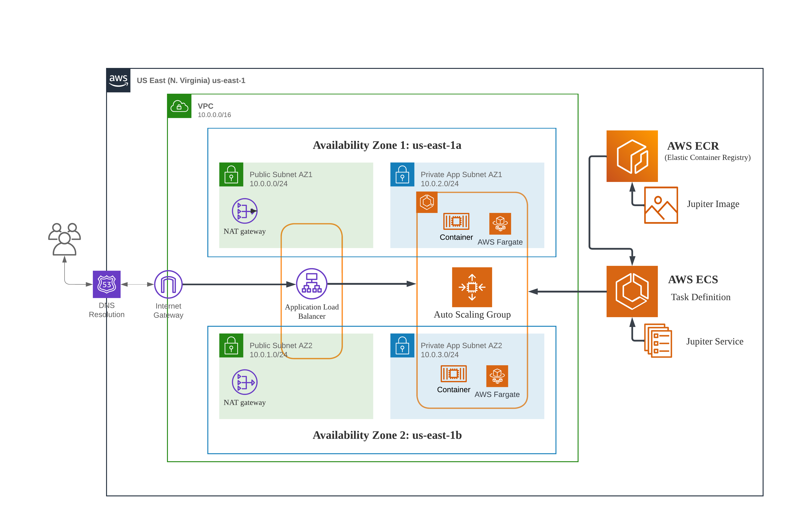

# AWS - Host static website using Elastic Container Service (ECS) and Terraform

## Overview
In this Lab, we are going to develop a static website and deploy it on AWS Elastic Container Service using Terraform. The architecture comprises the following components and services to ensure high availability and fault tolerance:


## Prerequisites
- Have basic <b>Docker</b> knowledge
- Have basic <b>AWS</b> knowledge
- Have basic <b>terraform</b> knowledge
- Developed the following project before: https://github.com/RoyGeagea/aws-ecs-static-website

## Get Started

### 1- Install Terraform
Visit https://developer.hashicorp.com/terraform/downloads?product_intent=terraform

### 2- Create Github free account
Visit https://github.com

### 3- Install Git
Visit https://git-scm.com/book/en/v2/Getting-Started-Installing-Git

### 4- Create SSH key
Visit https://docs.github.com/en/authentication/connecting-to-github-with-ssh/generating-a-new-ssh-key-and-adding-it-to-the-ssh-agent

### 5- Add the SSH key to your GitHub account
Visit https://docs.github.com/en/authentication/connecting-to-github-with-ssh/adding-a-new-ssh-key-to-your-github-account

### 6- Install Visual Studio
Visit https://visualstudio.microsoft.com/downloads/

### 7- Install Terraform extensions on Visual Studio
To install the Terraform extensions in Visual Studio, follow these steps:

1) Open Visual Studio.
2) Go to the "Extensions" section from the left bar
3) Search and install the following 2 extensions
    - `HashiCorp Terraform` extension by HashiCorp
    - `Terraform` by Anton Kulikov

### 8- Install AWS CLI
Visit https://docs.aws.amazon.com/cli/latest/userguide/getting-started-install.html

### 9- Create an IAM User with Admin Policy
1) Open the IAM (Identity and Access Management) console.
2) In the IAM console, click on "Users" in the left sidebar.
3) Click on the "Add user" button to create a new IAM user.
4) Provide a username for the new IAM user. Enable programmatic access.
5) Under "Set permissions", select "Attach existing policies directly".
6) In the policy search bar, type "AdministratorAccess" and select the policy named "AdministratorAccess" from the list. This policy grants full administrative access to the user.
7) Click on the "Next: Tags" button if you want to add tags to the user (optional).
8) Click on the "Next: Review" button to review the user configuration.
9) Review the user details and permissions to ensure they are correct.
10) Once you have reviewed the settings, click on the "Create user" button.

The IAM user with the Admin policy is now created. On the final screen, you will see the user details, including the user's access key ID and secret access key if programmatic access was enabled. Make sure to securely store these credentials, as they will be needed to access AWS services programmatically.

### 10- Set up AWS CLI with the newly created user
To set up AWS CLI with the newly created IAM user, follow these steps:

1) Open a terminal or command prompt on your local machine.
2) Run the following command to configure the AWS CLI:
    ```console
    $ aws configure
    ```
    You will be prompted to enter the AWS Access Key ID and Secret Access Key for the IAM user. Enter the values obtained during the creation of the IAM user with the Admin policy.

    When prompted for the Default region name, enter the AWS region where you want to perform your operations (e.g., us-east-1, eu-west-2). You can find the region codes in the AWS documentation.

    For the Default output format, you can leave it blank or enter a preferred format such as json, text, or table. The default value is json.

Once you have entered the required information, the AWS CLI will be configured with the IAM user's credentials.
To test the configuration, you can run a simple AWS CLI command, such as:
```console
$ aws s3 ls
```
This command lists the S3 buckets in your AWS account. If the configuration is successful, you should see the list of S3 buckets associated with your account.

Now you're ready to use the AWS CLI with the IAM user's credentials to interact with your AWS resources.

### 11- Create S3 bucket to store Terraform state file
Terraform maintains a record of resource states in a dedicated file known as the state file. By persistently storing the state of deployed resources, Terraform enables efficient subsequent deployments by leveraging the knowledge of the previous resource states. This allows Terraform to accurately determine the necessary changes and updates required to align the infrastructure with the desired configuration.

Let's create an S3 bucket with versioning enabled to store the Terraform state file:

1) Open the Amazon S3 console by searching for "S3" and click on the "Create bucket" button.
2) Provide a unique and meaningful name for your bucket. Bucket names must be globally unique across all AWS accounts.
3) Select the AWS Region where you want to create the bucket. 
4) Under "Configure options" leave the default settings as they are.
5) Scroll down to the "Set permissions" section and expand it.
6) Leave the default settings for "Block all public access" and "Bucket versioning" enabled. `Bucket versioning is necessary for Terraform state file management.`
7) Scroll down and click on the "Create bucket" button to create the S3 bucket.

### 12- Deploy the web server
The Terraform code for this project is hosted in this repository, and it's made of [modules](modules) and [jupiter-website-ecs](jupiter-website-ecs) folders.

To deploy the web server:
1) Enter the `jupiter-website-ecs` folder, by executing the below command:
    ```console
    $ cd jupiter-website-ecs
    ```
2) Open the `terraform.tfvars` file and locate the `container_image` variable. Replace its current value with the URI of your ECR Image. For detailed instructions, you can refer to the documentation available at https://github.com/RoyGeagea/aws-ecs-static-website.
3) Next, navigate to the `backend.tf` file. Update the value associated with the S3 bucket you intend to use for this project. Make sure to enter the correct bucket name and any other relevant configurations necessary for your deployment.
4) Deploy the infrastructure:
    ```console
    $ terraform init
    $ terraform apply
    ```
5) Wait few minutes until the ECS service is deployed, and then test from the ALB DNS name.

To destroy the infrastructure you can execute:
```console
$ terraform destroy
```

## Summary

Terraform revolutionizes infrastructure provisioning with its declarative approach and automation capabilities. Seamlessly integrating with AWS, Terraform empowers users to create and modify cloud resources efficiently. By leveraging Terraform's infrastructure-as-code paradigm, the project achieved streamlined deployments, scalability, and rapid application delivery. The benefits include enhanced efficiency, reduced errors, infrastructure standardization, and the ability to easily replicate and manage infrastructure across environments. With Terraform, organizations can focus on innovation and application development while harnessing the power of cloud-native infrastructure.
